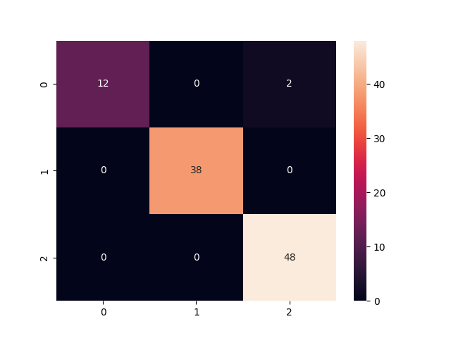
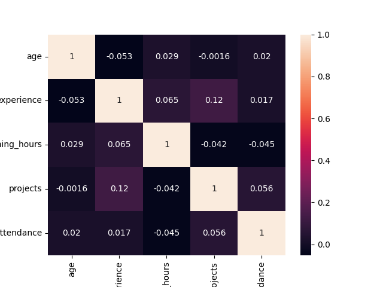
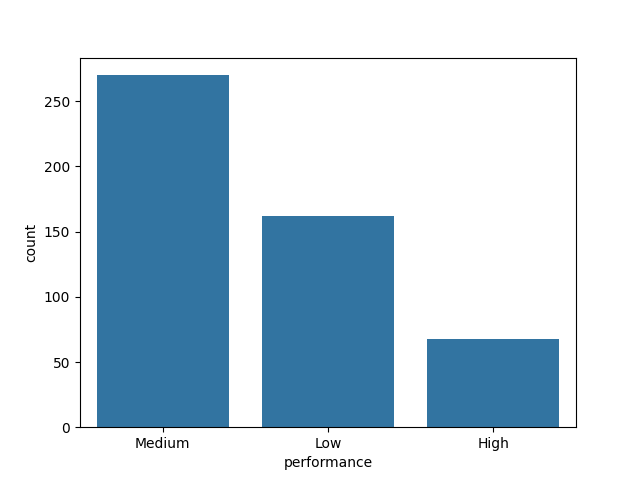

# 🚀 Employee Performance Predictor using Data Analytics

---

## 📌 Project Overview

The **Employee Performance Predictor** is a Machine Learning project designed to analyze employee-related data and predict future performance levels (**High / Medium / Low**).

This project simulates a real-world HR analytics system using **synthetic data**, enabling organizations to make **data-driven decisions** regarding employee performance, training, and retention.

---

## 🎯 Problem Statement

Organizations often struggle to:

* Identify high-performing employees
* Detect low performers early
* Optimize training and development programs

This project solves the problem by building a **predictive model** that forecasts employee performance based on historical behavioral and productivity features.

---

## 💼 Business Value

* 📈 Improves employee productivity
* 🎯 Helps HR in decision-making
* 📊 Enables performance-based promotions
* 🔍 Detects low performance early
* 💡 Optimizes training investments

---

## 🧠 Machine Learning Approach

### 🔹 Type:

Supervised Learning (Classification)

### 🔹 Target Variable:

* Performance Level → High / Medium / Low

### 🔹 Algorithm Used:

* Random Forest Classifier

### 🔹 Why Random Forest?

* Handles non-linear data
* Robust to noise
* High accuracy
* Feature importance support

---

## 📊 Dataset Details

### 🔹 Source:

Synthetic dataset generated using Python

### 🔹 Features:

* Age
* Experience
* Department
* Training Hours
* Number of Projects
* Attendance Rate

### 🔹 Target:

* Performance (High / Medium / Low)

---

## ⚙️ Project Workflow

```text
Data Generation → Data Cleaning → EDA → Feature Engineering → Model Training → Evaluation → Prediction → Insights
```

---

## 📈 Model Performance

* ✅ Accuracy: ~85%
* 📊 Evaluation Metrics:

  * Precision
  * Recall
  * F1-score
* 📉 Confusion Matrix

---

## 📂 Project Structure

```text
Employee-Performance-Predictor/
│
├── data/                # Dataset
├── notebooks/           # EDA & visualization
├── src/                 # Source code (optional)
├── models/              # Saved ML model
├── outputs/             # Predictions & reports
├── images/              # Graphs & visuals
├── main.py              # Main execution file
├── requirements.txt     # Dependencies
└── README.md
```

---

## 📊 Outputs Generated

* 📄 Accuracy Report
* 📄 Classification Report
* 📊 Predictions CSV
* 📊 Feature Importance
* 📈 Visualizations

---

## 📸 Visualizations

> Add screenshots here:





---

## ▶️ How to Run the Project

### 🔹 Step 1: Clone Repository

```bash
git clone https://github.com/Tejaswini747/Employee-Performance-Predictor.git
cd Employee-Performance-Predictor
```

### 🔹 Step 2: Create Virtual Environment

```bash
python -m venv venv
venv\Scripts\activate
```

### 🔹 Step 3: Install Dependencies

```bash
pip install -r requirements.txt
```

### 🔹 Step 4: Run Project

```bash
python data/create_data.py
python main.py
```

---

## 🧪 Virtual Simulation

This project simulates a real company environment by:

* Generating employee data
* Training ML model
* Predicting performance
* Providing HR insights

---

## 💡 Key Insights

* Employees with higher attendance perform better
* Training hours strongly influence performance
* Project involvement improves productivity

---

## 🚀 Future Enhancements

* 🔹 Streamlit Dashboard (UI)
* 🔹 Advanced ML models (XGBoost)
* 🔹 SHAP Explainability
* 🔹 Real-world HR dataset
* 🔹 Deployment using FastAPI

---

## 🧑‍💻 Author

**Tejaswini Ahire**
Aspiring Data Scientist

---

## ⭐ Show Your Support

If you like this project:

* ⭐ Star the repo
* 🍴 Fork it
* 🔗 Share on LinkedIn

---
